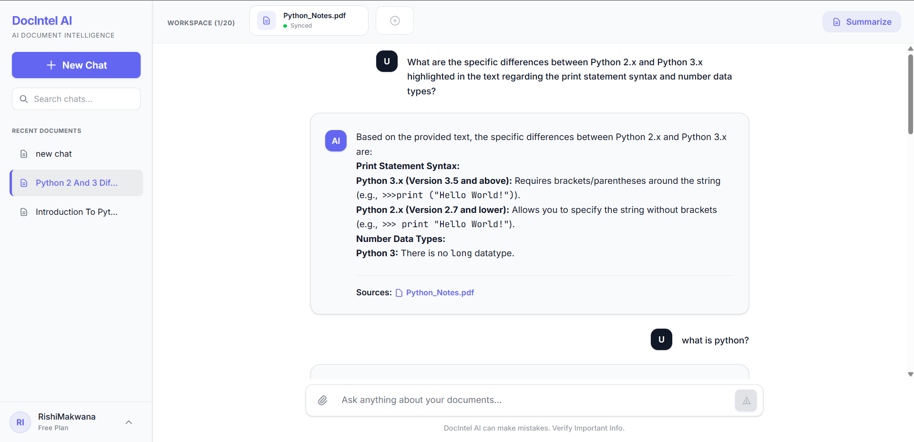
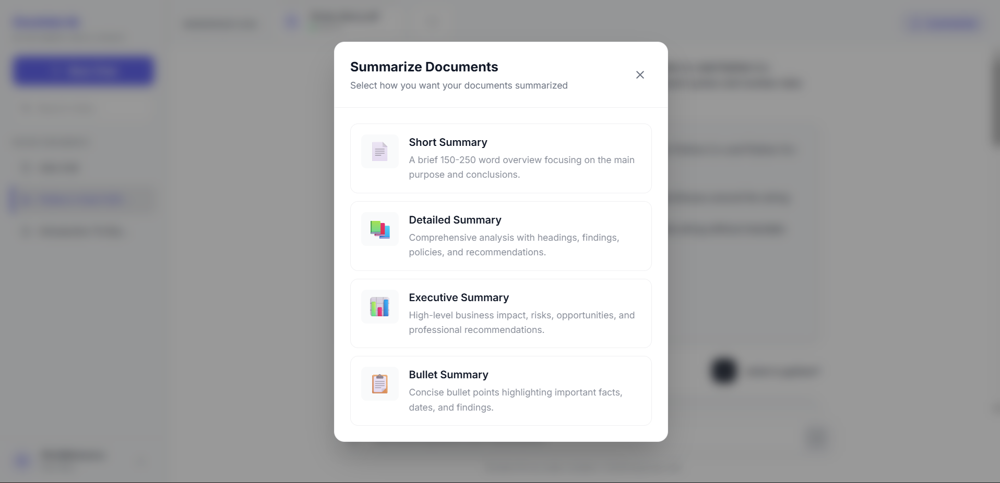
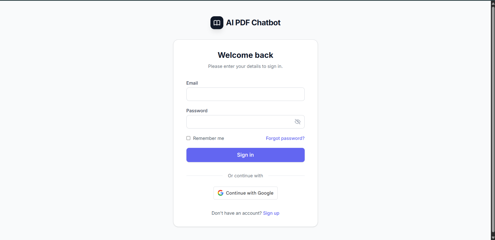
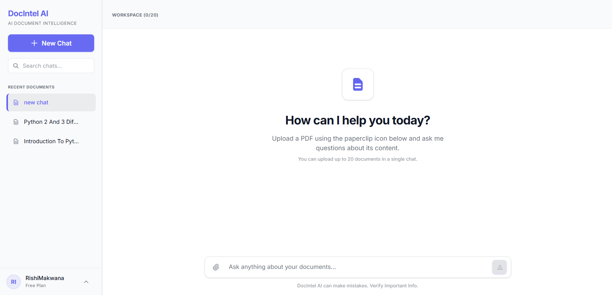
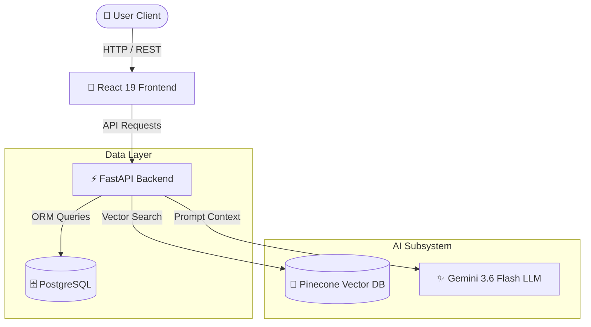
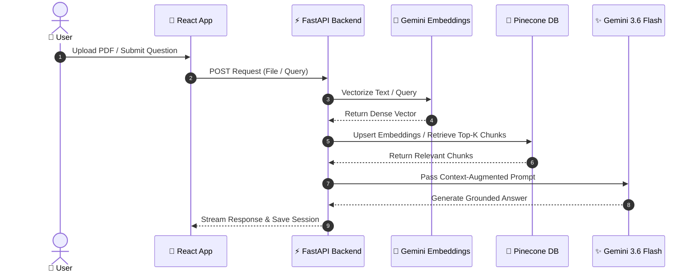

# 📄 DocIntel AI

[](LICENSE)
[](https://www.python.org/)
[](https://fastapi.tiangolo.com/)
[](https://react.dev/)
[](https://tailwindcss.com/)
[](https://ai.google.dev/)
[](https://www.pinecone.io/)
[](https://www.docker.com/)

DocIntel AI is a production-ready AI-powered document intelligence platform that enables users to upload and analyze one or multiple PDF documents using Retrieval-Augmented Generation (RAG). The platform provides intelligent document conversations, AI-generated summaries, suggested questions, secure authentication, personalized user profile management, and real-time streaming responses powered by Google Gemini, LangChain, and Pinecone.

## 📚 Table of Contents

- [✨ Project Highlights](#-project-highlights)
- [🌐 Live Demo](#-live-demo)
- [📸 Screenshots](#-screenshots)
- [🌟 Features](#-features)
- [🛠️ Tech Stack](#️-tech-stack)
- [🏗️ System Architecture](#️-system-architecture)
- [🔄 RAG Workflow](#-rag-workflow)
- [📁 Repository Structure](#-repository-structure)
- [⚙️ Environment Variables](#️-environment-variables)
- [🚀 Installation](#-installation)
- [🔗 API Endpoints](#-api-endpoints)
- [🛡️ Security](#️-security-features)
- [⚡ Performance](#-performance-optimizations)
- [🗺️ Roadmap](#️-roadmap)
- [📄 License](#-license)


### ✨ Project Highlights

- **Context-Grounded Q&A**: Semantic vector search with Pinecone ensures responses are generated strictly from uploaded document context.
- **Multi-Document Intelligence**: Upload and analyze multiple PDFs simultaneously within a single conversation.
- **Automated Document Intelligence**: AI-generated summaries and contextual suggested questions accelerate document exploration.
- **Personalized User Experience**: Secure profile management with avatar uploads, password management, and account statistics.
- **Multi-Tenant Session Isolation**: Conversation-scoped vector retrieval ensures complete data isolation between users.
- **Production-Ready Architecture**: Dockerized FastAPI backend, React frontend, PostgreSQL, and Pinecone designed for scalable deployment.

---

## 🌐 Live Demo

- 🌐 **Live Web Application**: [https://ai-pdf-chatbot-ashy.vercel.app](https://ai-pdf-chatbot-ashy.vercel.app)
- 🚀 **Backend API Server**: [https://ai-pdf-chatbot-ocyq.onrender.com](https://ai-pdf-chatbot-ocyq.onrender.com)
- 📖 **Swagger API Docs**: [https://ai-pdf-chatbot-ocyq.onrender.com/docs](https://ai-pdf-chatbot-ocyq.onrender.com/docs)

---

## 📸 Screenshots

| 💬 Chat & RAG Interface | 📑 Document Upload & Summary |
| :---: | :---: |
|  |  |

| 🔒 Authentication | 📊 Dashboard & History |
| :---: | :---: |
|  |  |

---


## 💡 Why DocIntel AI?

Traditional PDF readers rely on keyword search, making it difficult to extract contextual information from large documents.

DocIntel AI combines Retrieval-Augmented Generation (RAG), semantic search, Google Gemini, and Pinecone to provide grounded answers, automatic summaries, and intelligent document exploration while ensuring responses remain based on uploaded content.


## 🌟 Features

## 🔐 Authentication & User Management
- JWT bearer token authentication with secure password hashing (bcrypt).
- Google OAuth 2.0 Single Sign-On (SSO).
- Forgot password workflow with secure email-based reset tokens.
- Comprehensive user profile management.
- Update personal information including display name and bio.
- Upload and manage profile avatars with image validation.
- Secure password change with current password verification.
- Personalized account statistics including conversations, uploaded documents, and messages.

## 🤖 AI Document Intelligence
- Grounded document Q&A driven by Google Gemini 3.6 Flash via LangChain.
- High-dimensional vector embeddings using `models/gemini-embedding-2`.
- Sub-second vector similarity search using Pinecone serverless indexes.

### Document Processing
- Multi-PDF document upload and chunking with PyPDF text extraction.
- Automatic summary generation for uploaded files.
- Context-aware suggested follow-up questions per document.

## 💬 Conversation Management
- Persistent chat thread logging backed by PostgreSQL.
- Sidebar thread management with pinning capabilities.
- Automated conversation title generation based on initial prompts.

## 👤 User Profile
- View and update personal profile information.
- Upload and replace profile picture.
- Secure password management.
- Personalized account dashboard.
- Real-time account statistics.
- Responsive profile management interface.

### UI
- Responsive interface built with React 19, Vite, and Tailwind CSS v4.
- Global state management using Zustand.
- Markdown response rendering with syntax highlighting and toast alerts.

### Docker Support
- Containerized development and production setup using Docker and Docker Compose.

---

## 🛠️ Tech Stack

| Layer | Technology | Purpose |
| :--- | :--- | :--- |
| **Frontend** | React 19, Vite, Tailwind CSS v4, Zustand | Reactive user interface and global state management |
| **Backend** | Python, FastAPI, Uvicorn | Asynchronous RESTful backend service |
| **Database** | PostgreSQL, SQLAlchemy ORM | Relational data storage for users and chat sessions |
| **Vector DB** | Pinecone (`langchain-pinecone`) | Serverless vector indexing and similarity search |
| **AI Models** | Gemini 3.6 Flash, Gemini Embedding 2 | Natural language inference and text embedding generation |
| **Orchestration** | LangChain, PyPDF | RAG chain construction and PDF processing |
| **Security & Email** | JWT, Passlib (Bcrypt), FastAPI-Mail | Authentication and SMTP email delivery |
| **DevOps** | Docker, Docker Compose | Multi-container orchestration |

---

## 🏗️ System Architecture



---

## 🔄 RAG Workflow



### Pipeline Overview
- **Parsing & Chunking**: PDFs are processed via PyPDF and partitioned into overlapping chunks to preserve contextual flow across boundaries.
- **Vector Indexing**: Text chunks are embedded via `models/gemini-embedding-2` and upserted to Pinecone with conversation metadata tags.
- **Targeted Retrieval**: User queries are vectorized and matched against indexed vectors using cosine similarity, filtered strictly by conversation ID.
- **Context Augmentation**: Retrieved top-K document passages are combined with the query into a structured RAG prompt template.
- **Response Generation**: Gemini 3.6 Flash generates grounded responses based strictly on the retrieved document context.

---

## 📁 Repository Structure

```
AI-Pdf-Chatbot/
├── Backend/                      # FastAPI Backend Application
│   ├── app/
│   │   ├── auth/                 # JWT token authentication utilities
│   │   ├── chain/                # LangChain retrieval & RAG pipelines
│   │   ├── database/             # SQLAlchemy database connections & models
│   │   ├── models/               # ORM database schemas (User, Conversation)
│   │   ├── routers/              # API endpoint route handlers
│   │   ├── schemas/              # Pydantic request/response schemas
│   │   └── services/             # Vectorstore, LLM, PDF parser & mail services
│   ├── Dockerfile                # Backend container configuration
│   └── requirements.txt          # Backend Python dependencies
├── Frontend/                     # React Frontend Application
│   ├── src/
│   │   ├── api/                  # Axios HTTP client configuration
│   │   ├── components/           # UI components (Sidebar, ChatBox, Modals)
│   │   ├── store/                # Zustand global state stores
│   │   └── pages/                # App page layouts (Auth, Dashboard, Chat)
│   ├── Dockerfile                # Frontend container configuration
│   └── package.json              # Frontend node packages
└── docker-compose.yml            # Multi-service container orchestration
```

---

## ⚙️ Environment Variables

### Backend Configuration (`Backend/.env`)

| Variable | Description | Required |
| :--- | :--- | :---: |
| `FRONTEND_URL` | Allowed CORS origins (comma-separated) | Yes |
| `GOOGLE_API_KEY` | Google Gemini API key for LLM and embeddings | Yes |
| `DATABASE_URL` | PostgreSQL connection URL string | Yes |
| `GOOGLE_CLIENT_ID` | OAuth 2.0 Client ID for Google Authentication | Yes |
| `MAIL_USERNAME` | SMTP Email address for system emails | Yes |
| `MAIL_FROM` | Sender email address for outbound emails | Yes |
| `MAIL_PASSWORD` | App password for SMTP mail server | Yes |
| `MAIL_SERVER` | SMTP Server domain (`smtp.gmail.com`) | Yes |
| `PINECONE_API_KEY` | API Key for Pinecone vector database | Yes |
| `PINECONE_INDEX_NAME` | Pinecone index identifier | Yes |

### Frontend Configuration (`Frontend/.env`)

| Variable | Description | Required |
| :--- | :--- | :---: |
| `VITE_API_URL` | Base URL pointing to the FastAPI backend API | Yes |
| `VITE_GOOGLE_CLIENT_ID` | Client ID matching backend OAuth setup | Yes |

---

## 🚀 Installation

### 1. Docker Compose (Recommended)

1. Clone the repository:
   ```bash
   git clone https://github.com/Rishi5031/AI-Pdf-Chatbot.git
   cd AI-Pdf-Chatbot
   ```
2. Configure `.env` files in `Backend/` and `Frontend/`.
3. Launch services:
   ```bash
   docker compose up --build
   ```
4. Access app at `http://localhost:5173` and API docs at `http://localhost:8000/docs`.

### 2. Local Setup

#### Backend Setup
```bash
cd Backend
python -m venv venv
source venv/bin/activate  # On Windows: venv\Scripts\activate
pip install -r requirements.txt
uvicorn app.main:app --reload --host 0.0.0.0 --port 8000
```

#### Frontend Setup
```bash
cd Frontend
npm install
npm run dev
```

---

## 🔗 API Endpoints

| Category | Endpoint | Method | Description |
| :--- | :--- | :---: | :--- |
| **Auth** | `/auth/register` | `POST` | Register a new user account |
| **Auth** | `/auth/login` | `POST` | Authenticate user and issue JWT token |
| **Auth** | `/auth/google` | `POST` | Authenticate via Google OAuth 2.0 |
| **Upload** | `/upload/` | `POST` | Process PDF, generate embeddings & store in Pinecone |
| **Chat** | `/chat/` | `POST` | Send message and receive RAG-grounded response |
| **Conversations** | `/conversations/` | `GET` | Fetch all user chat histories |
| **Conversations** | `/conversations/{id}/pin` | `PUT` | Toggle pinned status of a conversation |
| **Documents** | `/documents/` | `GET` | Retrieve list of user's active documents |
| **Profile** | `/profile` | `GET` | Retrieve authenticated user profile |
| **Profile** | `/profile` | `PUT` | Update user profile information |
| **Profile** | `/profile/avatar` | `POST` | Upload or replace profile picture |
| **Profile** | `/profile/change-password` | `PUT` | Update account password |
| **Profile** | `/profile` | `DELETE` | Delete authenticated user account |

---

## 🛡️ Security Features

- **Password Hashing**: Password hashing using bcrypt via Passlib.
- **Stateless Tokens**: JWT bearer token authorization for protected API routes.
- **Access Control**: CORS origin whitelisting configured in FastAPI middleware.
- **ORM Protection**: Parameterized queries via SQLAlchemy to prevent SQL injection.

---

## ⚡ Performance Optimizations

- **Metadata-Filtered Vector Retrieval**: Pinecone queries utilize `conversation_id` metadata filters to eliminate full-index scans.
- **Optimized Chunking**: Balanced token chunk sizes prevent context fragmentation and cut prompt overhead.
- **Async Execution**: Non-blocking request processing using FastAPI async route handlers.
- **State Optimization**: Selective component rendering using Zustand store subscriptions.

---

## 🗺️ Roadmap

- [x] Multi-PDF ingestion and vector storage
- [x] Context-grounded Q&A with Gemini 3.6 Flash
- [x] Google OAuth 2.0 authentication
- [x] AI-generated document summaries
- [x] AI-generated suggested questions
- [x] User profile management
- [x] Multi-document conversations
- [x] Real-time streaming responses

### Upcoming Features

- [ ] Multi-format document ingestion (.docx, .txt, .pptx)
- [ ] Hybrid Search (BM25 + Dense Retrieval)
- [ ] OCR support for scanned PDFs
- [ ] Shared conversations
- [ ] Team workspaces
- [ ] AI document comparison
- [ ] Export chat as PDF or Markdown

---

⭐ If you found this project useful, consider giving it a star on GitHub.

Contributions, feedback, and feature suggestions are always welcome.